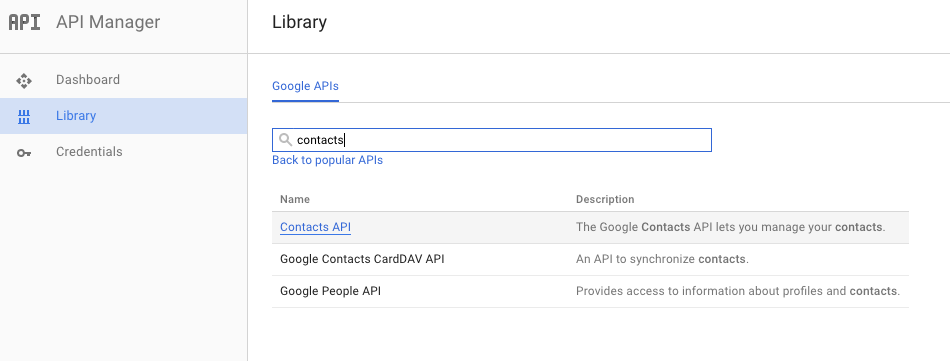
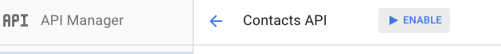
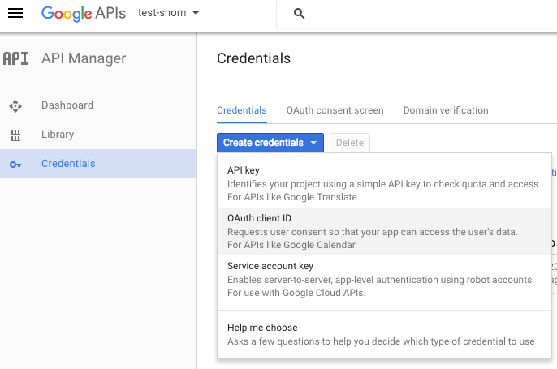
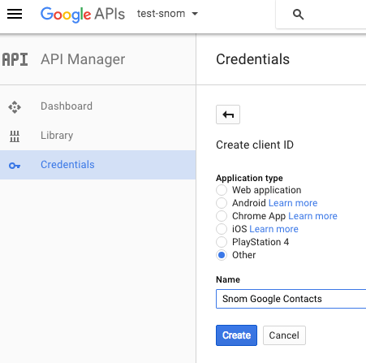
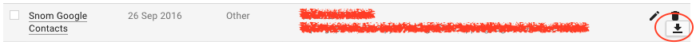

# Google Contacts integration Proof of Concept

#### DISCLAIMER:
This is just a proof of concept application demostrating a possible Google Contacts integration.
*The application is not suitable for production environments*.

## Concept

The application consists in 2 parts:

* a sync script
* a web application

The sync script is a python script which downloads the Google Contacts in a local JSON formatted file.
The web application serves the data formatted with the Snom XML browser syntax, the application shows some Snom XML Browser features:

* content pagination
* user input handling
* unicode icons usage

The web application is used also to display the caller ID of an incoming call trough an Action URL

## How to use it

### Obtaining the OAuth Client ID

1) In order to start the application you need to enable the contacts API [Google API Console](https://console.developers.google.com/apis/)

  
  
  Enable the API:
  
  


2) Once you enabled the API you need to create and download a `client secrets` JSON file from the [Google API Console](https://console.developers.google.com/apis/).

  

3) The file must be generated creating an OAuth *client ID*, selecting the Application type as *other*.

  

4) Downloading the file:

  

### Cloning the repository

```
git clone git@github.com:Snomio/google-contacts-poc.git
cd google-contacts-poc
```

### Running from the Docker container

The easiest way to run this application is to use the self-contained application distributed via a Docker image

#### Build the Docker image

```
docker build -t snom-gcontacts .
```

The image runs an entrypoint script which accepts the following parameters:

* sync: runs the synchronisation script
* run: run the web application serving the phone book and the caller-lookup service
* runandsync: first run the sync and then the the run script
* phoneconf: configure the settings `dkey_directory` and the `action_incoming_url`pointing to the web application (application URL must be defined via the `APP_URL` environment variable)

#### Run the sync script

In order to have data persistence and not loose the OAuth token is suggested to mount the following volumes on the container:

- `/data/client_secrets.json`: the client_script file
- `/data/client_secrets-datastore.json`: the local JSON database
- `/data/client_secrets.dat`: the OAuth token

The sync script needs the environment variable `CLIENT_SECRETS_JSON` defining the path to the client secrets file

```
$ touch client_secrets.dat
$ touch client_secrets-datastore.json
$ docker run -it -p 8080:8080 \
	-v $(pwd)/client_secrets.json:/data/client_secrets.json \
	-v $(pwd)/client_secrets-datastore.json:/data/client_secrets-datastore.json \
	-v $(pwd)/client_secrets.dat:/data/client_secrets.dat \
	-e CLIENT_SECRETS_JSON=/data/client_secrets.json \
	-e PHONE_URL=http://172.16.18.62 \
	-e APP_URL=http://172.16.18.15:8080 \
	snom-gcontacts sync
	
Go to the following link in your browser:
https://accounts.google.com/o/oauth2/auth?scope=https%3A%2F%2Fwww.googleapis.com%2Fauth%2Fcontacts.readonly&redirect_uri=urn%3Aietf%3Awg%3Aoauth%3A2.0%3Aoob&response_type=code&client_id=xxxxxyyyyy.apps.googleusercontent.com&access_type=offline

Enter verification code: *********************
Authentication successful.
Found 25 Personal Contacts
Found 25 contacts in group 'Snom'
```

#### Configure the phone

The Docker entry point script provides the `phoneconf` which configure remotely the setting `action_incoming_url` and `dkey_directory`:

```
$ docker run -it -p 8080:8080 \
	-v $(pwd)/client_secrets.json:/data/client_secrets.json \
	-v $(pwd)/client_secrets-datastore.json:/data/client_secrets-datastore.json \
	-v $(pwd)/client_secrets.dat:/data/client_secrets.dat \
	-e CLIENT_SECRETS_JSON=/data/client_secrets.json \
	-e PHONE_URL=http://172.16.18.62 \ # You will have to change it with your PHONE URL
	-e APP_URL=http://172.16.18.15:8080 \ # You will have to change it with your APP URL
	snom-gcontacts phoneconf
```

#### Start the web application

```
docker run -it -p 8080:8080 \
	-v $(pwd)/client_secrets.json:/data/client_secrets.json\
	-v -v $(pwd)/client_secrets-datastore.json:/data/client_secrets-datastore.json \
	-v $(pwd)/client_secrets.dat:/data/client_secrets.dat \
	-e CLIENT_SECRETS_JSON=/data/client_secrets.json \
	-e PHONE_URL=http://172.16.18.62 \
	-e APP_URL=http://172.16.18.15:8080 \
	snom-gcontacts run
```

### Running without Docker

If you prefer you can run the application trough the normal Python interpreter without Docker.

The application is written in Python and requires some additional modules, all the needed modules are listed into the `requirement.txt` file
You can install all the modules using `pip`:

```
pip install -r requirements.txt
```

> *Tip*: install all the needed stuff into a Python [virtualenv](https://virtualenv.pypa.io/en/stable/):
>
> - `virtualenv venv`
> - `. venv/bin/activate`
> - `pip install -r requirements.txt`

### Synchronizing the local datastore

Once you downloaded the `client_secrets.json` file you can run the sync script, please make sure to define the environment variable `CLIENT_SECRETS_JSON`
containing the path of the client_secrets file:

```
CLIENT_SECRETS_JSON=client_secrets.json python ./sync.py
```

By default the sync script downloads at maximum 1000 entries, you can change this value defining the environmental variable **MAX_RESULTS**

The first run the application will ask you to visit a google link and then paste the authorisation code received trough the link.

### Running the web application

The web application can be started with the following command:

```
cd web && python ./app.py
```

By default the application is listening on the port 8080

### Configuring the phone

The phone can access the address book configuring the phonebook key with: `dkey_directory=url http://APP_IP:8080/snom` where `APP_IP` is the application IP address.
The incoming call lookup can be enabled configuring a call incoming action URL: `action_incoming_url=http://172.16.18.15:8080/snom/lookup?number=$remote`.


